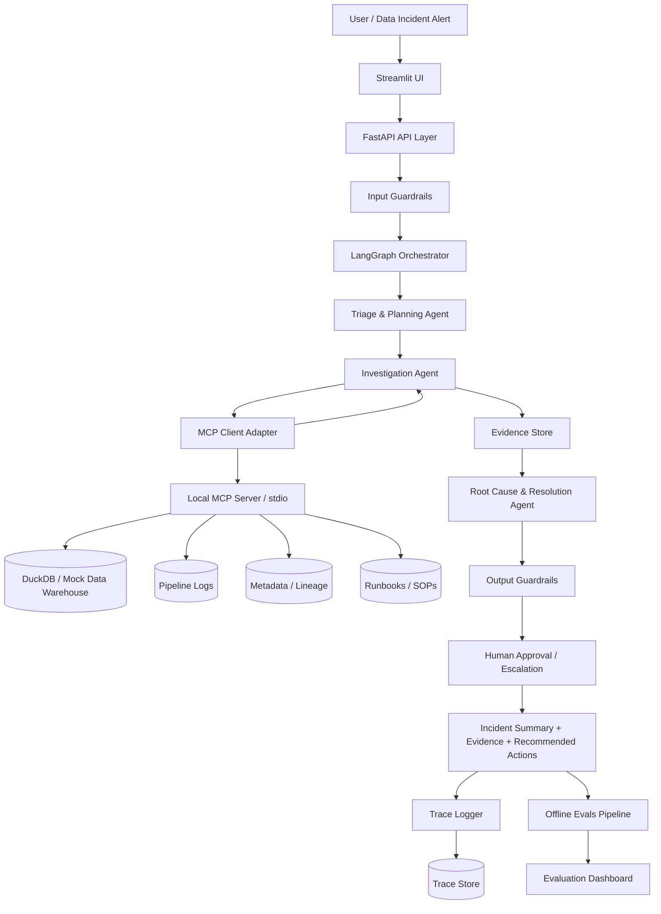
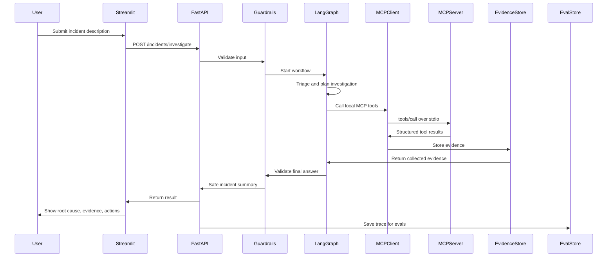

# AI DataOps Incident Agent — Codex Implementation Plan

## Project goal

Build a portfolio-ready **AI DataOps Incident Agent** that investigates data pipeline failures and metric anomalies using a simplified but production-style agentic architecture.

The project should demonstrate:

- Local Llama orchestration
- Multi-agent system design
- LangGraph-style workflow
- Local MCP tool access using a real MCP server over stdio
- Data/SQL diagnostics
- Pipeline log investigation
- Runbook retrieval
- Evidence-based reasoning
- Guardrails
- Human-in-the-loop approval
- Trace logging
- Offline evaluation pipeline
- Streamlit + FastAPI app structure

The system should stay realistic but small enough for a personal portfolio project.

---

## Core use case

A user notices something wrong in a dashboard or data pipeline and asks the system to investigate.

Example user query:

> Revenue dropped by 40% in today's dashboard. Can you check if this is a real business drop or a data issue?

The system should:

1. Classify the incident.
2. Plan the investigation.
3. Run SQL/data checks.
4. Check pipeline logs.
5. Search relevant runbooks/SOPs.
6. Collect evidence.
7. Infer the likely root cause.
8. Recommend next action.
9. Apply guardrails before final output.
10. Store traces and support offline evaluation.

---

## Simplified architecture

Use only **3 agents**:

1. **Triage & Planning Agent**
2. **Investigation Agent**
3. **Root Cause & Resolution Agent**

Supporting layers:

- FastAPI backend
- Streamlit frontend
- LangGraph workflow/orchestrator
- Local MCP server using the official Python MCP SDK
- DuckDB or SQLite warehouse
- Mock pipeline logs
- Mock metadata and runbooks
- Evidence store
- Guardrails
- Trace logging
- Offline evals

---

## Mermaid system design diagram

Codex can keep this diagram in the README as a Mermaid code block.



---

## User flow



---

## Recommended repository structure

Generate the project with this structure:

```text
ai-dataops-incident-agent/
├── README.md
├── steps.md
├── requirements.txt
├── .env.example
├── data/
│   ├── warehouse/
│   │   └── sample_data.duckdb
│   ├── logs/
│   │   ├── payment_events_ingestion.log
│   │   ├── orders_ingestion.log
│   │   └── daily_revenue_summary.log
│   ├── metadata/
│   │   ├── table_freshness.json
│   │   ├── lineage.json
│   │   └── schema_versions.json
│   ├── runbooks/
│   │   ├── revenue_dashboard_drop.md
│   │   ├── table_freshness_delay.md
│   │   ├── pipeline_failure.md
│   │   ├── schema_drift.md
│   │   └── null_spike.md
│   └── evals/
│       └── golden_incidents.jsonl
├── src/
│   ├── app/
│   │   ├── main.py
│   │   └── api.py
│   ├── agents/
│   │   ├── triage_agent.py
│   │   ├── investigation_agent.py
│   │   └── resolution_agent.py
│   ├── workflow/
│   │   ├── graph.py
│   │   └── state.py
│   ├── tools/
│   │   ├── mcp_server.py
│   │   ├── mcp_client.py
│   │   ├── sql_tools.py
│   │   ├── log_tools.py
│   │   ├── metadata_tools.py
│   │   └── runbook_tools.py
│   ├── guardrails/
│   │   ├── input_guardrails.py
│   │   ├── output_guardrails.py
│   │   └── tool_guardrails.py
│   ├── evidence/
│   │   └── evidence_store.py
│   ├── tracing/
│   │   └── trace_logger.py
│   ├── evals/
│   │   ├── run_evals.py
│   │   └── metrics.py
│   ├── llm/
│   │   ├── client.py
│   │   └── prompts.py
│   └── config.py
├── streamlit_app/
│   └── app.py
└── tests/
    ├── test_tools.py
    ├── test_guardrails.py
    ├── test_workflow.py
    └── test_evals.py
```

---

## Implementation principles for Codex

Follow these rules while generating the code:

1. Build the project incrementally.
2. Keep every component small and testable.
3. Prefer deterministic tools over local Llama reasoning where possible.
4. Use Pydantic models for request/response/state schemas.
5. Use mock data first; avoid external dependencies in the MVP.
6. Do not over-engineer the first version.
7. Keep all tool calls auditable.
8. Every final answer must include evidence.
9. Every risky recommendation must go through human approval.
10. Add tests after each core module.

### MVP simplicity rules

Use the simplest implementation that proves the architecture:

1. Prefer plain Python functions plus small classes over framework-heavy abstractions.
2. Keep one implementation path for each capability in the MVP.
3. Do not add plugin systems, dependency injection containers, background workers, queues, caching layers, vector databases, auth systems, or remote services.
4. Keep local Llama access as a thin Ollama client used by LangGraph nodes.
5. Keep the local MCP layer real, but minimal: one stdio server, one small client adapter, and the six required tools.
6. Store MVP artifacts as local files: DuckDB, JSON, JSONL, Markdown, and logs.
7. Add advanced patterns only after the end-to-end demo works and tests pass.

---

## Phase 1 — Bootstrap project

### Goal

Create the base project structure and install dependencies.

### Steps

1. Create the repository folders.
2. Create `requirements.txt` with:

```text
fastapi
uvicorn
streamlit
pydantic
python-dotenv
duckdb
pandas
langgraph
ollama
mcp[cli]
pytest
rich
```

3. Create `.env.example`:

```text
LLAMA_MODEL=llama3.1:8b
LLAMA_BASE_URL=http://localhost:11434
APP_ENV=local
```

4. Document local Llama setup commands in the README, for example:

```bash
ollama pull llama3.1:8b
ollama serve
```

5. Create `src/config.py` to load environment variables.
6. Create a minimal `README.md` with project title, use case, architecture, and run commands.
7. Create empty `__init__.py` files where needed.

### Acceptance criteria

- Project imports work.
- `pytest` runs without import errors.
- README contains the Mermaid system design diagram.
- No OpenAI, ChatGPT, hosted LLM API key, or external LLM service is required.

---

## Phase 2 — Create mock data

### Goal

Create realistic data that simulates a broken revenue dashboard caused by stale payment data.

### Scenario

Revenue dashboard shows a 40% drop. The real root cause is:

> `payment_events_ingestion` failed, causing the `payment_events` table to be stale. The revenue dashboard is under-reporting revenue because payment data did not refresh.

### Steps

1. Create a script `scripts/create_mock_data.py`.
2. Generate a DuckDB database with these tables:

```text
fact_orders
payment_events
daily_revenue_summary
pipeline_runs
```

3. `fact_orders` should look mostly normal.
4. `payment_events` should be stale or incomplete for the incident day.
5. `daily_revenue_summary` should show an apparent revenue drop.
6. `pipeline_runs` should include a failed `payment_events_ingestion` job.
7. Create mock logs in `data/logs/`.
8. Create metadata files:

```text
table_freshness.json
lineage.json
schema_versions.json
```

9. Create 5 runbooks in `data/runbooks/`.

### Example runbook names

```text
revenue_dashboard_drop.md
table_freshness_delay.md
pipeline_failure.md
schema_drift.md
null_spike.md
```

### Acceptance criteria

- DuckDB file is created successfully.
- SQL queries can read all tables.
- Mock incident has a known root cause.
- Runbooks contain clear troubleshooting steps.

---

## Phase 3 — Define schemas and workflow state

### Goal

Create clear typed schemas for the incident workflow.

### Steps

1. Create `src/workflow/state.py`.
2. Define only the Pydantic workflow models needed by the MVP.
3. Add required fields for incident requests, evidence, and responses.
4. Add serialization-friendly defaults for timestamps, lists, and dictionaries.
5. Add tests that instantiate and serialize the core models.

Define these Pydantic models:

```python
IncidentRequest
IncidentContext
InvestigationPlan
ToolCallRecord
EvidenceItem
IncidentFinding
IncidentRecommendation
WorkflowTrace
IncidentResponse
```

If a model is not used by Phase 11, remove it or leave it out until it is needed.

### Required fields

`IncidentRequest`:

```text
incident_id
user_query
metric_name
dashboard_name
severity
created_at
```

`EvidenceItem`:

```text
evidence_id
source_type
source_name
summary
raw_value
confidence
supports_root_cause
```

`IncidentResponse`:

```text
incident_id
incident_type
likely_root_cause
confidence
supporting_evidence
recommended_actions
requires_human_approval
escalation_reason
```

### Acceptance criteria

- All schemas are typed.
- Models can be serialized to JSON.
- Tests validate basic schema creation.

---

## Phase 4 — Build local MCP tool server

### Goal

Create deterministic tools exposed through a real local MCP server.

Use the official Python MCP SDK and run the server locally over `stdio`. Do not build a remote MCP server for the MVP. The FastAPI and LangGraph application should communicate with the MCP server through a small MCP client adapter instead of importing tool functions directly.

The local implementation should preserve testability by keeping business logic in ordinary Python modules and registering those functions as MCP tools in `src/tools/mcp_server.py`.

### Steps

1. Implement deterministic tool logic in `sql_tools.py`, `log_tools.py`, `metadata_tools.py`, and `runbook_tools.py`.
2. Create `src/tools/mcp_server.py` with a `FastMCP` server.
3. Register each tool with `@mcp.tool()`.
4. Create `src/tools/mcp_client.py` to connect over `stdio`.
5. Implement only two adapter methods first: `list_tools()` and `call_tool(name, arguments)`.
6. Update the Investigation Agent to use the MCP client adapter.
7. Add MCP discovery and tool-call tests.

### Transport choice

Use:

```text
stdio
```

Do not use:

```text
Streamable HTTP
remote MCP hosting
OAuth or external auth
```

Remote MCP can be listed as a future improvement, but the MVP should prove the real MCP protocol boundary locally.

### Tools to implement

In `src/tools/mcp_server.py`, create a `FastMCP` server and expose these tools with `@mcp.tool()`:

```python
run_sql_query(query: str) -> dict
check_table_freshness(table_name: str) -> dict
search_pipeline_logs(query: str) -> dict
lookup_lineage(asset_name: str) -> dict
search_runbooks(query: str) -> dict
create_incident_ticket(summary: str, severity: str) -> dict
```

The server should be runnable with:

```bash
python -m src.tools.mcp_server
```

The module should end with:

```python
if __name__ == "__main__":
    mcp.run(transport="stdio")
```

### MCP client adapter

Create `src/tools/mcp_client.py`.

Responsibilities:

1. Start the local MCP server over `stdio`.
2. Initialize an MCP client session.
3. Discover available tools with `tools/list`.
4. Call tools with `tools/call`.
5. Return normalized dictionaries to the Investigation Agent.
6. Hide MCP transport details from agent code.

Keep this adapter small. Do not add connection pooling, retries, async job handling, remote transports, or dynamic server registries in the MVP.

The Investigation Agent should call the adapter, not import `run_sql_query`, `check_table_freshness`, or other tool functions directly.

### Tool responsibilities

#### `run_sql_query`

Runs read-only SQL queries on DuckDB.

Guardrails:

- Allow only `SELECT` queries.
- Block `INSERT`, `UPDATE`, `DELETE`, `DROP`, `ALTER`, `CREATE`.
- Limit rows returned.

#### `check_table_freshness`

Reads `table_freshness.json` and returns last refresh time, expected refresh time, and freshness status.

#### `search_pipeline_logs`

Searches mock log files for job failures, error messages, and timestamps.

#### `lookup_lineage`

Reads `lineage.json` and returns upstream/downstream dependencies.

#### `search_runbooks`

Keyword-searches Markdown runbooks and returns relevant sections.

#### `create_incident_ticket`

Creates a mock incident ticket in a local JSON file. Do not call external services.

### Acceptance criteria

- Each tool has unit tests.
- MCP server starts locally over `stdio`.
- MCP tool discovery returns all expected tools.
- MCP tool calls work through the MCP client adapter.
- SQL tool blocks unsafe queries.
- Tool outputs are structured dictionaries.
- Tool outputs are suitable for evidence generation.
- Tests cover both direct business logic and MCP client/server integration.

---

## Phase 5 — Build guardrails

### Goal

Add production-style controls without overcomplicating the project.

### Steps

1. Implement input guardrails.
2. Implement tool guardrails.
3. Implement output guardrails.
4. Wire guardrails into the workflow.
5. Add tests for unsafe input, unsafe SQL, and unsupported final answers.

Use simple rule-based validation in the MVP. Do not add policy engines, classifier models, external moderation APIs, or complex prompt-review loops.

### Input guardrails

Create `src/guardrails/input_guardrails.py`.

Validate:

- query is not empty;
- query is related to data incident investigation;
- query does not request destructive action;
- query does not include secrets or credentials.

### Tool guardrails

Create `src/guardrails/tool_guardrails.py`.

Validate:

- SQL is read-only;
- tool arguments are not empty;
- row limits are enforced;
- unknown table access is blocked or warned.

### Output guardrails

Create `src/guardrails/output_guardrails.py`.

Validate:

- final answer includes evidence;
- confidence is present;
- risky action requires human approval;
- no unsupported absolute claim is made;
- no sensitive information is exposed.

### Acceptance criteria

- Guardrails have tests.
- Unsafe SQL is blocked.
- Final answer without evidence is rejected or revised.

---

## Phase 6 — Build local Llama client for LangGraph nodes

### Goal

Create a thin local Llama client that LangGraph agent nodes can call. The MVP must use a locally running Llama model only, with no OpenAI, ChatGPT, Anthropic, Gemini, hosted inference API, or other external LLM service.

Use a local runtime such as Ollama for development. The default local endpoint should be:

```text
http://localhost:11434
```

The application should fail with a clear setup message if the local Llama runtime is unavailable.

This phase is not a second orchestration layer. LangGraph owns workflow control; `LlamaClient` only sends prompts to local Llama and returns parsed JSON.

### Steps

1. Create `src/llm/client.py`.
2. Create a `LlamaClient` class.
3. Create a `MockLlamaClient` for tests.
4. Create `src/llm/prompts.py`.
5. Load `LLAMA_MODEL` and `LLAMA_BASE_URL` from config.
6. Implement one method first: `generate_json(prompt: str) -> dict`.
7. Add prompts for:

```text
Triage & Planning Agent
Investigation Agent
Root Cause & Resolution Agent
Output Guardrail Review
```

### Prompt design requirements

All prompts should require structured JSON output.

The local Llama model should be instructed to:

- reason from evidence only;
- avoid unsupported claims;
- return confidence;
- cite evidence IDs;
- recommend human approval for risky actions;
- ask for more investigation when evidence is weak.

### Acceptance criteria

- Llama client can be swapped for a mock in tests.
- Prompts are separated from business logic.
- Tests can run without calling the real local Llama runtime.
- No hosted LLM API key or cloud LLM SDK is used.
- No streaming, tool-calling, provider routing, retry framework, or model registry is added in the MVP.

---

## Phase 7 — Build Agent 1: Triage & Planning Agent

### Goal

Classify the incident and create an investigation plan.

### Steps

1. Create `src/agents/triage_agent.py`.
2. Accept an `IncidentRequest`.
3. Classify the incident type.
4. Extract affected metrics, dashboards, tables, pipelines, and date range.
5. Select required investigation checks.
6. Return a structured `InvestigationPlan`.

### File

`src/agents/triage_agent.py`

### Input

`IncidentRequest`

### Output

`InvestigationPlan`

### Responsibilities

1. Classify incident type:

```text
metric_anomaly
freshness_issue
pipeline_failure
schema_drift
data_quality_issue
unknown
```

2. Extract affected entities:

```text
metric_name
dashboard_name
table_names
pipeline_names
date_range
```

3. Decide required checks:

```text
sql_metric_check
freshness_check
log_check
lineage_check
runbook_check
schema_check
```

4. Estimate severity.
5. Return a step-by-step plan.

### Acceptance criteria

- Given a revenue-drop query, the agent returns `metric_anomaly`.
- The plan includes SQL, freshness, logs, and runbook checks.
- Output is structured.

---

## Phase 8 — Build Agent 2: Investigation Agent

### Goal

Execute the investigation plan by calling the local MCP server through `src/tools/mcp_client.py` and collecting evidence.

### Steps

1. Create `src/agents/investigation_agent.py`.
2. Accept an `InvestigationPlan`.
3. Call SQL, freshness, log, lineage, and runbook tools through `src/tools/mcp_client.py`.
4. Convert each tool result into an `EvidenceItem`.
5. Save evidence to the Evidence Store.
6. Return the collected evidence list.

### File

`src/agents/investigation_agent.py`

### Input

`InvestigationPlan`

### Output

List of `EvidenceItem`

### Responsibilities

1. Call `run_sql_query` through the MCP client adapter for metric comparison.
2. Call `check_table_freshness` through the MCP client adapter for relevant tables.
3. Call `search_pipeline_logs` through the MCP client adapter for failed jobs.
4. Call `lookup_lineage` through the MCP client adapter for upstream/downstream dependencies.
5. Call `search_runbooks` through the MCP client adapter for SOP guidance.
6. Convert tool results into evidence items.
7. Store evidence in the Evidence Store.

### Suggested SQL checks

```sql
SELECT order_date, COUNT(*) AS orders, SUM(order_amount) AS order_value
FROM fact_orders
GROUP BY order_date
ORDER BY order_date DESC
LIMIT 7;
```

```sql
SELECT payment_date, COUNT(*) AS payments, SUM(payment_amount) AS payment_value
FROM payment_events
GROUP BY payment_date
ORDER BY payment_date DESC
LIMIT 7;
```

```sql
SELECT summary_date, revenue
FROM daily_revenue_summary
ORDER BY summary_date DESC
LIMIT 7;
```

### Acceptance criteria

- Investigation Agent can run all needed tools through the local MCP client adapter.
- Investigation Agent does not directly import tool implementation functions.
- Evidence clearly supports or rejects hypotheses.
- Evidence includes source names and confidence.

---

## Phase 9 — Build Evidence Store

### Goal

Create a simple evidence layer that makes the final answer grounded and auditable.

### Steps

1. Create `src/evidence/evidence_store.py`.
2. Implement in-memory evidence storage for an active workflow run.
3. Persist completed incident evidence to JSON.
4. Retrieve evidence by incident ID.
5. Return evidence summaries for final responses and API endpoints.

Keep this as a small file-backed store. Do not add a database, ORM, search index, or repository layer in the MVP.

### File

`src/evidence/evidence_store.py`

### Responsibilities

1. Save evidence items in memory during workflow.
2. Persist evidence to JSON after workflow completion.
3. Retrieve evidence by incident ID.
4. Return evidence summary for final answer.

### Acceptance criteria

- Evidence items can be saved and loaded.
- Evidence includes source type and source name.
- Final answer can reference evidence IDs.

---

## Phase 10 — Build Agent 3: Root Cause & Resolution Agent

### Goal

Generate the final incident diagnosis using collected evidence.

### Steps

1. Create `src/agents/resolution_agent.py`.
2. Accept a list of `EvidenceItem` records.
3. Infer the likely root cause from evidence only.
4. Assign confidence and cite evidence IDs.
5. Recommend next actions.
6. Mark risky actions as requiring human approval.
7. Return a structured `IncidentResponse`.

### File

`src/agents/resolution_agent.py`

### Input

List of `EvidenceItem`

### Output

`IncidentResponse`

### Responsibilities

1. Infer likely root cause.
2. Assign confidence:

```text
low
medium
high
```

3. Include supporting evidence IDs.
4. Recommend next actions.
5. Decide whether human approval is required.
6. Generate final incident summary.

### Example expected output

```json
{
  "incident_type": "metric_anomaly",
  "likely_root_cause": "payment_events table is stale because payment_events_ingestion failed, causing revenue to be under-reported.",
  "confidence": "high",
  "supporting_evidence": ["ev_001", "ev_002", "ev_003"],
  "recommended_actions": [
    "Re-run payment_events_ingestion pipeline",
    "Validate payment_events row count after reload",
    "Re-run daily_revenue_summary pipeline",
    "Refresh revenue dashboard",
    "Notify finance analytics team"
  ],
  "requires_human_approval": true,
  "escalation_reason": "The recommendation involves re-running data pipelines."
}
```

### Acceptance criteria

- Output includes evidence references.
- Output avoids unsupported claims.
- Risky actions require approval.
- Tests pass with mock evidence.

---

## Phase 11 — Build LangGraph workflow

### Goal

Wire the 3 agents into a clear workflow.

### Steps

1. Create `src/workflow/graph.py`.
2. Define workflow state transitions.
3. Add nodes for guardrails, agents, MCP-backed investigation, approval, and trace logging.
4. Wire the local MCP client adapter into the investigation node.
5. Return a final `IncidentResponse`.
6. Add workflow tests with `MockLlamaClient`.

### File

`src/workflow/graph.py`

### Workflow nodes

```text
input_guardrails
triage_and_planning
investigation
root_cause_resolution
output_guardrails
human_approval_gate
trace_logging
```

### Workflow flow

```text
IncidentRequest
→ Input Guardrails
→ Triage & Planning Agent
→ Investigation Agent
→ Local MCP Client Adapter
→ Local MCP Server over stdio
→ Investigation Agent
→ Evidence Store
→ Root Cause & Resolution Agent
→ Output Guardrails
→ Human Approval / Escalation
→ IncidentResponse
→ Trace Logger
```

### Acceptance criteria

- Workflow can be run from a Python function.
- Workflow returns an `IncidentResponse`.
- Workflow logs trace events.
- Workflow can be tested with `MockLlamaClient`.

---

## Phase 12 — Build trace logging

### Goal

Capture enough observability to show production readiness.

### Steps

1. Create `src/tracing/trace_logger.py`.
2. Define trace event schema.
3. Log major workflow, agent, guardrail, MCP tool, and response events.
4. Persist trace records to JSONL.
5. Add a loader that can read traces into pandas.

Keep tracing as append-only JSONL. Do not add OpenTelemetry, spans, exporters, dashboards, or distributed tracing until after the MVP.

### File

`src/tracing/trace_logger.py`

### Log these events

```text
incident_received
input_guardrail_passed
triage_completed
agent_started
agent_completed
tool_called
tool_result_received
evidence_created
resolution_generated
output_guardrail_passed
human_approval_required
final_response_returned
```

### Trace fields

```text
trace_id
incident_id
timestamp
node_name
event_type
input_summary
output_summary
latency_ms
tool_name
status
error
```

### Storage

Store traces as JSONL:

```text
data/traces/traces.jsonl
```

### Acceptance criteria

- Every workflow run produces trace records.
- Trace records can be loaded into pandas.
- Streamlit can show basic trace timeline.

---

## Phase 13 — Build FastAPI backend

### Goal

Expose the workflow through a clean API.

### Steps

1. Create `src/app/main.py`.
2. Add health, investigation, trace, and evidence endpoints.
3. Convert API requests into `IncidentRequest` objects.
4. Run the LangGraph workflow from the investigation endpoint.
5. Return structured responses, evidence, and traces.

Keep the API synchronous for the MVP. Do not add auth, background jobs, queues, websockets, or multi-user state.

### File

`src/app/main.py`

### Endpoints

```text
GET /health
POST /incidents/investigate
GET /incidents/{incident_id}/trace
GET /incidents/{incident_id}/evidence
```

### `POST /incidents/investigate` input

```json
{
  "user_query": "Revenue dropped by 40% in today's dashboard. Please investigate.",
  "metric_name": "revenue",
  "dashboard_name": "daily_revenue_dashboard",
  "severity": "high"
}
```

### Acceptance criteria

- FastAPI starts with Uvicorn.
- API returns structured incident response.
- API can return trace and evidence.

---

## Phase 14 — Build Streamlit UI

### Goal

Create a simple demo interface.

### Steps

1. Create `streamlit_app/app.py`.
2. Add the incident input form.
3. Call the FastAPI investigation endpoint.
4. Display the root cause, confidence, evidence, recommended actions, and approval state.
5. Display trace timeline and evaluation summary placeholders.

Keep the UI as a simple demo surface. Do not add complex session management, custom components, streaming updates, or dashboard builders in the MVP.

### File

`streamlit_app/app.py`

### UI sections

1. Incident input form
2. Investigation result
3. Evidence table
4. Recommended actions
5. Human approval / escalation buttons
6. Trace timeline
7. Evaluation summary placeholder

### User flow in UI

```text
User enters incident
→ clicks Investigate
→ sees progress/status
→ sees root cause summary
→ reviews evidence
→ approves, escalates, or asks for more investigation
```

### Acceptance criteria

- UI works locally.
- UI calls FastAPI endpoint.
- UI displays final response, evidence and traces.

---

## Phase 15 — Build offline evaluation pipeline

### Goal

Evaluate whether the agent finds the correct root cause and uses the right tools.

### Steps

1. Create `data/evals/golden_incidents.jsonl`.
2. Create `src/evals/metrics.py`.
3. Create `src/evals/run_evals.py`.
4. Replay golden incidents through the workflow.
5. Compare incident type, root cause, tool usage, evidence coverage, and approval behavior.
6. Save the eval report to JSON.

Keep evals deterministic and small. Do not add experiment tracking, judge models, prompt optimization, or evaluation dashboards before the MVP works.

### File

`src/evals/run_evals.py`

### Golden dataset

Create `data/evals/golden_incidents.jsonl`.

Each record should include:

```json
{
  "incident_id": "golden_001",
  "user_query": "Revenue dropped by 40% in today's dashboard.",
  "expected_incident_type": "metric_anomaly",
  "expected_root_cause": "payment_events_ingestion failed",
  "expected_tools": ["run_sql_query", "check_table_freshness", "search_pipeline_logs", "search_runbooks"],
  "expected_evidence_sources": ["payment_events", "pipeline_logs", "revenue_dashboard_drop_runbook"],
  "should_require_human_approval": true
}
```

### Metrics

Implement in `src/evals/metrics.py`:

```text
incident_type_accuracy
root_cause_match_score
tool_selection_precision
tool_selection_recall
evidence_coverage
human_approval_accuracy
guardrail_pass_rate
average_latency_ms
```

### Acceptance criteria

- Eval pipeline can replay golden incidents.
- Eval report is saved to JSON.
- Streamlit can display eval metrics.

---

## Phase 16 — Add README documentation

### Goal

Make the project portfolio-ready.

### Steps

1. Create or update `README.md`.
2. Add project overview, problem statement, and architecture diagram.
3. Document the local MCP tool layer and `stdio` transport.
4. Add run commands for mock data, FastAPI, Streamlit, tests, and evals.
5. Include example incident input and example output.
6. Add future improvements.

### README sections

1. Project title
2. Problem statement
3. Why this matters
4. Architecture diagram
5. User flow
6. Tech stack
7. Agent design
8. MCP tool layer
9. Guardrails
10. Evaluation pipeline
11. Local Llama setup
12. No hosted LLM services
13. Demo screenshots placeholder
14. How to run locally
15. Example incident
16. Example output
17. Future improvements

### Project title

```text
AI DataOps Incident Agent
```

### Subtitle

```text
A production-style multi-agent system for investigating data pipeline failures and metric anomalies using local Llama, MCP tools, guardrails, evidence-based reasoning and task-level evals.
```

### Acceptance criteria

- README explains the system clearly.
- Mermaid diagram renders on GitHub.
- Setup instructions are complete.
- README explains that the project uses local Llama only and does not require hosted LLM credentials.

---